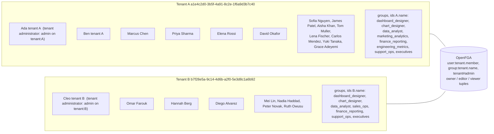
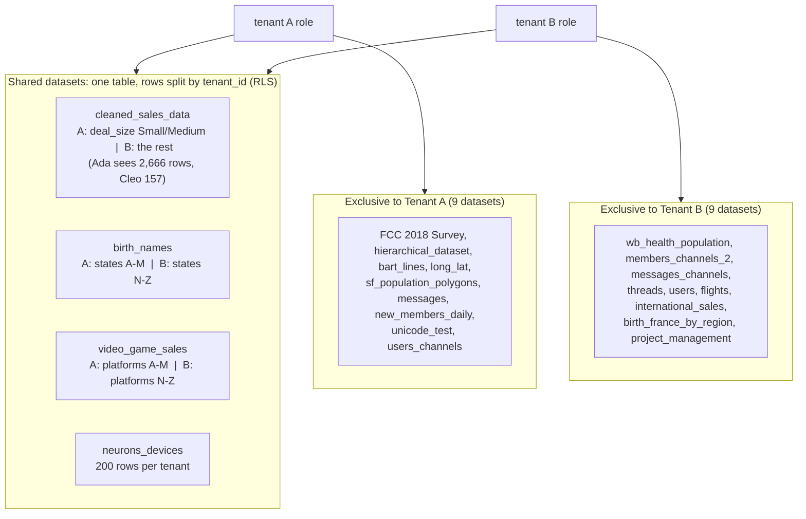
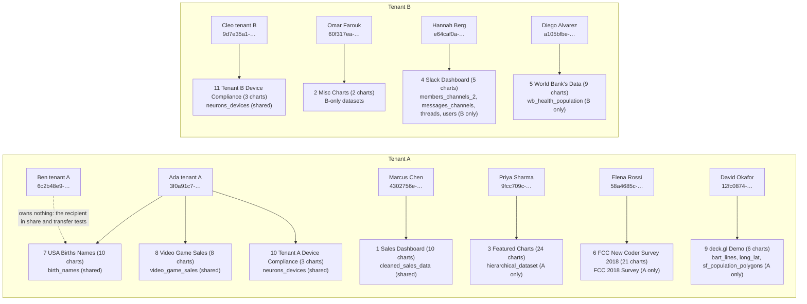

# Object ownership & sharing for Preset PCS (PCS-10243)

Take a **stock** Preset PCS image, add the `superset-ownership` wheel and a
rebuilt frontend bundle, and get a PCS image with object ownership &
sharing: private-by-default objects, per-object / per-tenant sharing,
transfer of ownership, authorization in OpenFGA, and a parallel migration
chain that never touches the customer's own Superset schema.

Nothing under `superset/` is modified. The backend is one pip wheel that
wires itself in through Superset's config hooks; the frontend is an overlay
applied before `npm run build`; OpenFGA runs as its own compose project so
it survives every rebuild and teardown of the PCS stack.

Where this lives: development happens on the `pcs-package` branch of the
internal repo (`amaannawab923/client-test`; `pcs-setup` there is the older
overlay-only delivery). **https://github.com/amaannawab923/pcs-ownership-ivanti**
is a snapshot of that branch, published so it can be cloned and tested
without access to the internal repo. The stock Preset PCS source is never
part of either -- it is fetched when you build.

## Quick setup

**Prerequisites:** Docker Desktop running (BuildKit on, at least 8 GB RAM
for the frontend build), `git`, `curl`, `python3`, and git access to
`preset-io/preset-pcs` (the repo is private; the build clones the tag with
whatever GitHub credentials git already has -- `gh auth setup-git`, a
credential helper, or SSH). Ports 8097, 8199, 8183 and 3010 must be free.

### 1. Clone

```bash
git clone https://github.com/amaannawab923/pcs-ownership-ivanti.git
```

### 2. Build, start, seed

From inside the cloned folder:

```bash
./setup.sh --skip-sync --up && ./scratch/seed-multitenant.sh
```

First run 15-20 minutes (stock PCS v6.1.0.7 is cloned and built, then the
ownership image, then OpenFGA and Superset come up and the two-tenant data
is seeded). It ends with `scratch stack is up: http://localhost:8097`.

Log in at http://localhost:8097 -- password `test1234` for all of them,
`admin` / `admin` for the Superset admin:

| Persona | Username |
|---|---|
| Ada -- tenant A administrator | `3f0a91c7-2d84-4e63-9b15-7c4e8a2f6d31` |
| Ben -- tenant A member | `6c2b48e9-5a71-4f92-8d03-2e9b7c1a4d53` |
| Cleo -- tenant B administrator | `9d7e35a1-8c62-4b04-a7f1-3d5e9b2c8a76` |
| Marcus Chen, Priya Sharma, Elena Rossi ... (tenant A); Omar Farouk, Hannah Berg, Mei Lin ... (tenant B) | see "The seeded world" below |

Other ways to supply the stock source, if the clone cannot authenticate:
`PCS_GIT_URL=git@github.com:preset-io/preset-pcs.git` (SSH),
`PCS_LOCAL_CHECKOUT=<path to a preset-pcs clone>`, or
`PCS_TARBALL_URL=<release tarball URL or file://...>` (with `GITHUB_TOKEN`
for a private URL). Already have a stock PCS image?
`./setup.sh --pcs-image <image> --skip-sync --up` skips the stock build.
A different PCS tag: `./setup.sh --pcs-ref <tag> ...` (default v6.1.0.7).

### 3. First things to try

1. As **Ada**: Charts -> search "Girl Name Cloud" -> Sharing (row action) ->
   **Private** -> Apply. The Sharing column now reads Private.
2. Log out, log in as **Ben**: Dashboards -> "USA Births Names". The
   "Girl Name Cloud" tile keeps its title but shows *You don't have access to
   this chart ... reach out to the chart owner: Ada tenant A*. Every other tile
   renders.
3. Back as **Ada**: same drawer -> **Shared** -> Add users & groups -> pick
   "Ben tenant A" -> Confirm -> Apply. Within ~10 seconds (the outbox drains to
   OpenFGA) Ben's tile renders with data.
4. Log in as **Cleo** (tenant B): she never sees tenant A's objects -- not
   the private or shared ones, and not the public ones either: *public means
   public within the tenant* -- and the same shared datasets show her only
   tenant B's rows.
5. Transfer ownership: in Ada's drawer -> "Transfer ownership" -> pick Ben.
   Ben now owns the chart. Reopen the drawer as Ada: she is told she is not
   the owner, the sharing options are greyed out, and she is offered **Take
   ownership**. A tenant administrator decides who *owns* an object, never
   who *else* sees it -- to change the sharing she takes it first, and the
   Owner column then says so. She does see every object of her own tenant,
   private ones included (otherwise the row to act on would not be there);
   log in as Ben, make the chart Private, and it is still in Ada's list and
   opens for her, while Marcus (a plain member) no longer sees it.

### 4. Complete example, login by login: Ada and Ben and one chart

Chart: **"Girl Name Cloud"** (chart 78), owned by Ada, on the dashboard
**"USA Births Names"**. Both users are in tenant A. Every login is at
http://localhost:8097/login/ ; log out at http://localhost:8097/logout/
before switching.

| # | Log in as | Username / password | Do | You see |
|---|---|---|---|---|
| 1 | **Ada** | `3f0a91c7-2d84-4e63-9b15-7c4e8a2f6d31` / `test1234` | Charts -> search "Girl Name Cloud" | The chart is listed. Owner column: *Ada tenant A*. Sharing column: *Public* |
| 2 | **Ben** | `6c2b48e9-5a71-4f92-8d03-2e9b7c1a4d53` / `test1234` | Charts -> search "Girl Name Cloud"; Dashboards -> "USA Births Names" | The chart is listed for Ben too (Owner *Ada tenant A*); on the dashboard the word-cloud tile renders with data. Public means everyone in the tenant can open it |
| 3 | **Ada** | as above | Charts -> "Girl Name Cloud" -> row action **Sharing** | The drawer opens: *Owner: Ada tenant A*, **Public** selected, "Transfer ownership" link |
| 4 | **Ben** | as above | Same as step 2 | Still visible, still renders -- nothing has changed yet |
| 5 | **Ada** | as above | Charts -> "Girl Name Cloud" -> **Sharing** -> select **Shared** -> do NOT add anyone -> **Apply** | Sharing column now reads *Shared*; the drawer says "Shared with 0 users / 0 groups". Public -> Shared with an empty list is what revokes everyone but the owner |
| 6 | **Ben** | as above | Charts -> search "Girl Name Cloud"; Dashboards -> "USA Births Names" | The chart is **gone from Ben's Charts list**. On the dashboard its tile is a placeholder: *You don't have access to this chart. You do not have access to the chart "Girl Name Cloud" ... To request access, reach out to the chart owner: Ada tenant A*. Opening http://localhost:8097/explore/?slice_id=78 gives no data |
| 7 | **Ada** | as above | Charts -> "Girl Name Cloud" -> **Sharing** | Drawer shows **Shared**, empty share list |
| 8 | **Ada** | (still logged in) | **Add users & groups** -> Users tab -> type "Ben" -> tick **Ben tenant A** -> **Confirm** -> **Apply** | Drawer says "Shared with 1 user"; Sharing column still *Shared*. (Groups tab -> **chart_designer** works the same: Ben is in that group) |
| 9 | **Ben** | as above | Wait ~10 seconds, then Charts -> search "Girl Name Cloud"; Dashboards -> "USA Births Names" | The chart is **back in Ben's list**, and the tile renders with data again |

Repeat 5 -> 6 -> 8 -> 9 as often as you like (remove Ben with the x on his
row in the drawer, Apply; add him back, Apply): the chart disappears and
reappears for Ben each time. To end, Ada sets it back to **Public** -> Apply.

What is happening underneath: each Apply writes or deletes one tuple in
OpenFGA (`user:6c2b48e9-... viewer chart:<uuid>`). A removal takes effect on
Ben's next request; a grant lands after the outbox drains (a few seconds).
Cleo (tenant B, `9d7e35a1-8c62-4b04-a7f1-3d5e9b2c8a76` / `test1234`) never
sees the chart in any of these states. Throughout, `docker exec
pcssetup-superset-1 superset ownership check` stays `ok: true`. This is case
OWN-135 in `qa/manual-test-cases.md`.

The full set of 142 manual cases with expected results, as executed against
this build, is in `qa/manual-test-cases.md` (blank the `Result:` lines for a
clean sheet).

### Handy checks

```bash
docker exec pcssetup-superset-1 superset ownership check      # ok: true, dashboard_chart_patch_installed: true
```
```bash
docker exec pcssetup-superset-1 superset ownership status     # switches, object and share counts
```
```bash
scripts/verify-image.sh pcs-ownership:dev                     # the 11 image checks, any time
```
```bash
curl -s http://localhost:8199/stores | python3 -m json.tool   # the stores OpenFGA holds
```

### Start over

```bash
docker compose -p pcssetup -f docker-compose.pcs-setup.yml -f scratch/docker-compose.scratch.yml down -v && rm -rf .seed-out scratch/.scratch-out
```

OpenFGA and every store in it survive that (it is its own compose project,
`pcsfga`); `openfga/down.sh` removes them too, after asking. Re-running step 2
from there is exactly the from-scratch run recorded in
`scratch/scratch-run.md`.

## The seeded world: two tenants, who owns what

Everything the scratch harness creates is deterministic, so this is what
you get every time. Password is `test1234` for every user; the username is
the Neurons member GUID. The ids are Neurons' own shapes (confirmed by
Ivanti): a person is `user:<tenant guid>.<member guid>` in the store, the
tenant role is `Tenant_<guid>_Role`, a group is `group:<tenant guid>.<local
id>`, and a tenant's administrators hold the `admin` relation on the tenant
object itself (written by the platform, never by this module). Ben is a
chart designer, and chart designers are nested into dashboard designers.

### Tenants, users and groups



A user only ever sees their own tenant: the sharing picker lists tenant
members and groups only, a share to the other tenant's group is refused, and
a private or shared object of tenant A is a 404 for everyone in tenant B.

### Data: shared datasets (row-level security) and exclusive datasets



Datasets are the *data* boundary (Superset RLS and datasource grants, as
Ivanti already runs them). Ownership is the *object* boundary on top:
whoever owns a dashboard or chart decides who can open it, but nobody can be
given a chart whose dataset their tenant cannot read -- a share or transfer
to such a user is refused up front. And the object boundary never crosses the
tenant line: a **public** object is public *within its tenant* (its owner,
the members of its tenant, Superset admins), so a dashboard on a shared
dataset built by Ada is never listed for, or openable by, Cleo -- even
though Cleo can read that dataset's tenant-B rows herself. Every ownership
row carries the object's tenant (mirrored from OpenFGA's `tenant` tuple) and
the rule is decided from that row alone, with no store call.

### Dashboards and charts: who owns what



Every chart on a dashboard is owned by that dashboard's owner (the
attribution script sets both), and every object starts `public` after the
backfill: 11 dashboards and 108 charts owned, one example chart left
unowned on purpose (it has no recoverable creator -- the "claim" scenario).

### The full list

| Persona | Username (GUID) | Tenant | Groups | Owns |
|---|---|---|---|---|
| Ada tenant A | `3f0a91c7-2d84-4e63-9b15-7c4e8a2f6d31` | A -- administrator (`admin` on `tenant:A`) | dashboard_designer | dashboards 7, 8, 10 and their 21 charts |
| Ben tenant A | `6c2b48e9-5a71-4f92-8d03-2e9b7c1a4d53` | A | chart_designer | nothing -- the recipient in share/transfer tests |
| Marcus Chen | `4302756e-b4aa-4938-b599-ed593444aeaf` | A | chart_designer, data_analyst | dashboard 1 Sales Dashboard, 10 charts |
| Priya Sharma | `9fcc709c-1a6b-4882-b8e3-1787afe31417` | A | dashboard_designer, data_analyst | dashboard 3 Featured Charts, 24 charts |
| Elena Rossi | `58a4685c-6e11-4c4f-aad3-444839fc846a` | A | data_analyst | dashboard 6 FCC New Coder Survey, 21 charts |
| David Okafor | `12fc0874-6358-48e8-96cb-6ada75fd8c76` | A | marketing_analytics | dashboard 9 deck.gl Demo, 6 charts |
| Cleo tenant B | `9d7e35a1-8c62-4b04-a7f1-3d5e9b2c8a76` | B -- administrator (`admin` on `tenant:B`) | dashboard_designer | dashboard 11 Tenant B Device Compliance, 3 charts |
| Omar Farouk | `60f317ea-66cb-48a0-8d45-e15699486409` | B | dashboard_designer, sales_ops | dashboard 2 Misc Charts, 2 charts |
| Hannah Berg | `e64caf0a-30fc-4f79-8f5a-e0a64dced4ad` | B | data_analyst | dashboard 4 Slack Dashboard, 5 charts |
| Diego Alvarez | `a105bfbe-3b53-43d6-bc1c-953293a35c54` | B | sales_ops | dashboard 5 World Bank's Data, 9 charts |
| `admin` / `admin` | -- | none (Superset admin) | -- | nothing; sees everything, can manage everything |

The other 12 seeded users (Sofia Nguyen, James Patel, Aisha Khan, Tom
Muller, Lena Fischer, Carlos Mendez, Yuki Tanaka, Grace Adeyemi in A; Mei
Lin, Nadia Haddad, Peter Novak, Ruth Owusu in B) own nothing and exist to
populate the picker and the groups; their GUIDs are printed by
`overlay/qa/seed_directory.py` when it runs.

Good demo pairs: **Ada -> Ben** (same tenant: share, transfer, placeholder
tile), **Ada -> Cleo** (other tenant: never visible, refused as a share
target), **Marcus's Sales Dashboard opened as Ada vs Cleo** (same dashboard,
different rows under RLS).

## The two-step picture

```
        step 1 (yours already,               step 2 (this shell)
         or built by ./setup.sh)
   ┌─────────────────────────┐          ┌──────────────────────────────┐
   │   stock PCS lean image  │  ─────►  │  overlay/frontend bundle +   │  ──►  pcs-ownership:<tag>
   │   (PCS_IMAGE)            │          │  superset-ownership wheel    │
   └─────────────────────────┘          └──────────────────────────────┘
```

Step 1 never changes: it's the PCS `Dockerfile`'s `lean` target, built from
an untouched PCS source tree. Step 2 (`docker/Dockerfile.pcs-ownership`)
rebuilds ONLY the frontend bundle (from the same stock source, with this
overlay's `overlay/frontend/` copied over it), builds the
`superset-ownership` wheel from `overlay/pythonpath/superset_ownership/`
(`packaging/`), and layers the built assets + the wheel (installed into the
image's own venv) + the one-line config shim onto step 1's image. **Nothing
under `/app/superset` is overwritten**: the backend installs as a package
and wires itself in at runtime through Superset's config hooks; the one
place it depends on stock code (the dashboard-tile access marker, a wrap of
`DashboardRestApi._serialize_dashboard_chart`) is pinned to the stock
method's shape and source and asserted at build time and at boot. The stock
image is never modified in place -- a PCS version bump is steps 1 and 2
again, not a merge.

## OpenFGA is its own project

`openfga/docker-compose.openfga.yml` (compose project `pcsfga`) runs OpenFGA
with its own Postgres and volume on the shared network `pcsfga`. The PCS
stack joins that network and reaches it as `http://openfga:8080`; nothing in
`docker compose -p pcssetup down -v` touches it, so stores survive every
image rebuild and every teardown of the stack. `openfga/up.sh` (idempotent;
called by `setup.sh` and `scratch/seed-multitenant.sh`) brings it up and
waits for `/healthz`; `openfga/down.sh` is the only thing that deletes it,
and asks first.

## What's in this shell

| Path | What |
|---|---|
| `overlay/pythonpath/superset_ownership/` | the module: API, hooks, CLI, Alembic chain (`migrations/`), the OpenFGA model (`model/ownership.fga`), settings/plugin loader, the config layer (`configure.py`) and the dashboard-tile wrap (`dashboard_patch.py`). Synced verbatim from client-test main; packaged as the `superset-ownership` wheel by `packaging/build-wheel.sh` (the Dockerfile's `wheel-builder` stage does the same). |
| `packaging/` | `superset-ownership/pyproject.toml` + README (hatchling; tests excluded; migrations/model data files included) and `build-wheel.sh`. Kept outside the synced module directory on purpose -- `sync-from-main.sh` regenerates that directory wholesale. |
| `overlay/pythonpath/superset_config_ownership.py` | a one-line shim re-exporting `superset_ownership.configure.configure`, so the documented `from superset_config_ownership import configure; configure(globals())` keeps working. The only file dropped on `PYTHONPATH` by default. |
| `overlay/pythonpath/ivanti_pcs_example/` | the reference plug-in package (worked examples of `Identity`/`Directory`/`Authorizer`/FGA-connection overrides). NOT wired into any default config. |
| `overlay/frontend/` | new + replaced frontend files, mirroring `superset-frontend/`'s own root (both `src/` and `packages/superset-ui-core/`). Tests included -- cheap, and they're the spec for what "correct" looks like. |
| `overlay/config/superset_config_docker.example.py` | the ONE file the client edits: the plug-in block (values) + a commented hooks block (only touch if the defaults aren't enough), ending in `configure(globals())`. |
| `overlay/qa/` | 11 operator scripts synced from client-test's `qa/` (seeding, scenario setup, parity checks) -- tooling, not part of the image. |
| `MANIFEST` | generated, one line per overlay file: `<kind> <path>`. Never hand-edited. |
| `UPSTREAM_SHA` | sha256, at upstream v6.1.0.7, of every stock file the overlay replaces (the 9 frontend files) plus the 2 reference-only sources -- the drift-guard input. |
| `scripts/fetch-pcs.sh` | materializes the stock PCS source tree into `.pcs-src/` (gitignored): a shallow clone of the tag by default, or from a local checkout or a release tarball URL. |
| `scripts/sync-from-main.sh` | **regenerates** `overlay/`, `MANIFEST`, `UPSTREAM_SHA` from a client-test ref, by diffing it against upstream v6.1.0.7 and sorting every changed path into a known bucket. Fails loudly on an unrecognized path -- see "Upgrade story" below. |
| `scripts/apply-overlay.sh` | drift guard, then copies the overlay onto an extracted PCS source tree (`--check-only` runs just the guard). This is the from-source path -- e.g. for pcs-ivanti's own FIPS Dockerfile; `docker/Dockerfile.pcs-ownership` does the equivalent inline for the two-step path. |
| `scripts/verify-image.sh` | post-build: module + config layer importable, `superset ownership --help` works, the built bundle contains the ownership strings. |
| `docker/Dockerfile.pcs-ownership` | the two-step build (`frontend` stage rebuilds the bundle, `final` stage layers onto `PCS_IMAGE`). |
| `docker/build.sh` | internal helper `setup.sh` calls for the two `docker build`s. |
| `docker/entrypoint-ownership.sh` | wraps the stock entrypoint: runs the stock init when asked, then the ownership migration, then execs the stock command. Idempotent. Applying the ownership migration backfills every existing object: `superset ownership db upgrade` is immediately followed by `superset_ownership.backfill.run()` (every pre-existing chart/dashboard gets an explicit `ownership_object` row, visibility **public**, owner resolved from its own creator -- `created_by_fk` -> `changed_by_fk` -> `OWNERSHIP_DEFAULT_OWNER` -> its tenant's administrator) and `superset ownership backfill-tenants`, THEN `superset ownership check`. This is one step, not a separate operator command that can be forgotten -- a brownfield instance is never left with an ungoverned object between "the migration ran" and "someone remembered to backfill". Nobody within the tenant loses access: visibility is always public here, so the Sharing column reads "Public" for every pre-existing object, and every member of the object's tenant opens it as before; what changes is that a pre-existing object on a shared dataset is no longer readable from the other tenant (public within the tenant). `backfill-tenants` is what stamps the tenant; `check` fails on any public object whose tenant could be stamped but was not. Idempotent on every container start: an object that already has a row is left alone (or, if it was previously left unowned, re-attributed once real history exists -- see `scratch/` for that in practice). |
| `docker/seed.sh` | demo-only: creates a scratch OpenFGA store, installs the model, writes a tiny tenant vocabulary (2 tenants, 4 users -- real GUID v4 strings, not slugs; identity.py requires it), 2 groups. Writes the resolved store/model id to `.seed-out/seed.env` (gitignored). |
| `docker/demo-superset-config-docker.py` | demo-only: the "rest of PCS's own docker config" (`DATABASE_*` -> `SQLALCHEMY_DATABASE_URI`, `CACHE_CONFIG`, `SECRET_KEY`) a real deployment already has, plus a guard that refuses to start rather than silently falling through to the module's shared-store default (see "a trap worth knowing" below) -- then `exec`s the actual `overlay/config/superset_config_docker.example.py` unmodified. |
| `docker-compose.pcs-setup.yml` | demo stack, project name **always** `pcssetup`. |

## Overlay counts (from the last sync)

Generated by `scripts/sync-from-main.sh` against `client-test/main`
(22c6565821) vs upstream `76151beade` (v6.1.0.7) -- the header line of
`MANIFEST` always says which:

```
module (superset_ownership):     65 files  (incl. configure.py, dashboard_patch.py, plugin_hooks.py,
                                             tests, 7 migrations, 2 model, 1 UPDATING.md; shipped as the wheel)
frontend:                        25 files  (13 replace: 10 core files incl. 2 superset-ui-core, 3 tests;
                                             12 new: 11 under src/features/ownership/ + the error-message
                                             component)
backend core:                     0 files  (nothing under superset/ is replaced; sync-from-main.sh refuses a
                                             main that forks it)
reference (ivanti_pcs_example):    8 files  (hooks.py, config_hooks_example.py, ...; NOT wired by default)
qa operator tooling:              11 scripts
---------------------------------------
overlay total:                   109 files
config layer (generated, not in the diff): 2 files (the 1-line superset_config_ownership.py shim, the .example.py)
UPSTREAM_SHA entries:             15  (the 13 frontend replace-files + the 2 reference-only config/entrypoint
                                       sources)
```

The sixteen function-level `OWNERSHIP_*` hook seams (`plugin_hooks.py`,
finer-grained than the four class-level seams `OWNERSHIP_IDENTITY` /
`DIRECTORY` / `AUTHORIZER` / `FGA_CONFIG_PROVIDER`) are listed, commented
out, in `overlay/config/superset_config_docker.example.py`'s hooks block;
`ivanti_pcs_example/hooks.py` implements all sixteen as a worked example.
None are wired by default.

Excluded on purpose (process/research, not delivered): `qa/reviews/*`,
`qa/design/*`, `.github/workflows/ownership-tests.yml`, `demo-ownership.sh`,
root `UPDATING.md`, `docker-compose-light.override.yml`,
`docker/pythonpath_dev/.gitignore`.

Two files are tracked in `UPSTREAM_SHA` for drift **but never copied** onto
the tree: `docker/pythonpath_dev/superset_config_docker_light.py` (the dev
config the wheel's `configure()` mirrors) and
`docker/entrypoints/run-server.sh` (source of the `SERVER_WORKER_AMOUNT`
export `entrypoint-ownership.sh` carries forward -- see below).

## What the client edits: one file

`overlay/config/superset_config_docker.example.py`, renamed to
`superset_config_docker.py` and mounted/copied to the image's PYTHONPATH
(`/app/pythonpath/superset_config_docker.py`, picked up via
`SUPERSET_CONFIG_PATH`). It has two parts:

1. **The plug-in block** -- values only. `OWNERSHIP_ENABLED`,
   `OWNERSHIP_AUTHORIZER` (`"local"` or `"openfga"`), the OpenFGA
   connection, `OWNERSHIP_GROUP_ID_FORMAT`, `OWNERSHIP_PUBLIC_SCOPE`
   (`"tenant"`, the default: public means public within the tenant;
   `"instance"`: Superset's dataset grant alone decides, as before), etc.
   Every other key defaults to reproducing the pre-feature baseline -- an
   empty block is valid.
2. **The hooks block** -- commented out. Only uncomment a line if the
   defaults in (1) don't fit your directory/identity/authorizer shape;
   `overlay/pythonpath/ivanti_pcs_example/README.md` has worked examples
   for each (`AttributeIdentity`, `FixedGroupsDirectory`,
   `PrefixedIdAuthorizer`, a custom FGA connection provider).

The file ends with `from superset_config_ownership import configure;
configure(globals())` -- that one call applies the whole feature layer
(switch derivation, `FEATURE_FLAGS`, `BLUEPRINTS`, hooks wiring, the Celery
outbox opt-in, every `OWNERSHIP_*` default) with the exact same precedence
and defaults as client-test main's own `superset_config_docker_light.py`.
Nothing else in this file needs to change for the common case.

## The upgrade story

1. Bump the PCS ref: `./setup.sh --pcs-ref v6.1.1.0` (or edit
   `PCS_REF` if calling `scripts/fetch-pcs.sh` directly).
2. Re-sync: `scripts/sync-from-main.sh <client-test ref>` regenerates
   `overlay/`, `MANIFEST` and `UPSTREAM_SHA` from the new upstream diff. It
   **fails loudly** if a changed file doesn't fall into a known bucket
   (module / frontend / reference / qa-tooling / config-source), and
   refuses outright if main forks anything under `superset/` -- the wheel
   cannot carry that. Update the bucket/exclude tables in the script (never
   hand-edit `MANIFEST`) when a new path appears.
3. Re-diff only the files `UPSTREAM_SHA` names against the new PCS release
   -- that's the whole "did upstream move under us" surface for the
   frontend, by construction. The backend's one dependency on stock code
   (the dashboard-tile wrap) is checked separately by the build step
   (`assert_stock_file()`) -- see "PCS version bump procedure" below.
4. `scripts/apply-overlay.sh --check-only .pcs-src` (or just re-run
   `./setup.sh`, which does this as step 3) -- fails if any replaced file
   drifted upstream since the overlay was cut.
5. `UPSTREAM_SHA` is regenerated automatically by step 2 above; nothing to
   refresh by hand.

End to end that is one command: `./setup.sh --pcs-ref <new ref> --up`
(with `--skip-sync` to build exactly what is committed).

## What is NOT in this shell

- No OpenFGA **server** for production -- `openfga/` runs one for the demo
  and test stacks only; production points `OWNERSHIP_FGA_API_URL` at
  whatever OpenFGA deployment the customer (or Ivanti) operates.
- No identity provider / SSO. `OWNERSHIP_IDENTITY` assumes a Superset user
  already exists (however that got provisioned -- JIT, SCIM, manual);
  `ivanti_pcs_example.identity` is a worked example of adapting the member
  GUID lookup, not an identity provider.
- The PCS source tree itself. `scripts/fetch-pcs.sh` materializes it into
  the gitignored `.pcs-src/` at build time; it is never committed here.

## Known stock defects (reproduced from the pcs-ivanti spike, if seen)

- **`npm ci` lock drift**: some PCS revisions have `package.json` /
  `package-lock.json` out of sync (`Missing: <pkg> from lock file`).
  `docker/Dockerfile.pcs-ownership`'s `frontend` stage falls back to `npm
  install --no-audit --no-fund` and prints a `WARNING` when this happens --
  this is a **pre-existing upstream condition**, twelve-plus lines before
  the overlay is ever copied in, not something this overlay causes. The
  real fix is resyncing the lock in preset-pcs/client-test.
- **`superset-core` / Python version floor**: not applicable to the v6.1.0.7
  base this shell targets (its `lean` target already copies
  `superset-core` and targets Python 3.11). Relevant only if pcs-ivanti's
  own FIPS base is still pinned below Python 3.11 -- see their own
  Dockerfile, not this one.
- **Postgres driver**: the stock `lean` target does not install one
  (`requirements/base.txt` treats it as the optional `apache-superset
  [postgres]` extra; only the dev image's bootstrap script installs it, at
  container start). `docker/Dockerfile.pcs-ownership`'s `final` stage adds
  `psycopg2-binary` explicitly, labeled as not-really-part-of-the-overlay,
  purely so this shell's own demo compose (a real Postgres) has something
  to connect with. A real client PCS image already talks to production
  Postgres and so already has a driver.

## A trap worth knowing: `OPENFGA_STORE_ID` and shell scope

`fga_connection.py` ships a hardcoded `DEFAULT_STORE_ID` fallback (a real,
shared development store) for exactly the case an unconfigured from-source
checkout wants zero-config access to the team's store. That is correct
there and dangerous here: `OWNERSHIP_FGA_STORE` in the example config reads
`os.environ.get("OPENFGA_STORE_ID", "")`, and a blank value is "not set
here" under `settings.get`'s precedence -- it falls through to that same
shared-store default. `docker compose --profile seed run --rm seed` writes
the demo's own store id to `.seed-out/seed.env`; if you `source` it in one
shell and then run `docker compose up` in a **different** shell (or a
different script invocation -- environment does not cross that boundary),
`OPENFGA_STORE_ID` is unset again and every ownership command silently
targets the shared store instead of the demo's. `docker/demo-superset-
config-docker.py` now refuses to start rather than do that silently
(`RuntimeError` naming exactly what's missing); `./setup.sh --up` sources
`.seed-out/seed.env` and brings up `superset`/`worker` in the same script
run, so it never hits this. Only a concern if you drive the steps by hand.

## For pcs-ivanti (applying this to your FIPS build)

You do not need `docker/Dockerfile.pcs-ownership` at all -- that is this
shell's own two-step demonstration path. What actually matters for your
Dockerfile: the frontend overlay lands *before* your `npm run build`; the
backend is one wheel install plus a one-line shim; one build-time check;
and one entrypoint swap.

```dockerfile
# before your frontend build (npm run build) -- your source tree, not this shell's:
COPY overlay/frontend/ /app/superset-frontend/

# in your final/runtime stage. The PCS venv ships `uv`, not `pip` (a bare
# `pip install` fails with "No module named pip"); --no-deps because the
# venv is already fully pinned and everything the wheel needs is in it.
# Build the wheel with packaging/build-wheel.sh (or take the one Preset
# ships) -- it is a plain, pure-Python wheel.
COPY superset_ownership-0.5.0-py3-none-any.whl /tmp/
RUN uv pip install --python /app/.venv/bin/python --no-deps /tmp/superset_ownership-0.5.0-py3-none-any.whl \
 && rm /tmp/superset_ownership-0.5.0-py3-none-any.whl

# the ONE pythonpath entry -- a single file, never a directory COPY or bind
# mount over your image's PYTHONPATH entry (the earlier pcs-ivanti spike's
# trap: a directory-level mount hides everything else already on it). Do
# NOT also copy superset_ownership onto PYTHONPATH: it would shadow the wheel.
COPY overlay/pythonpath/superset_config_ownership.py /app/pythonpath/superset_config_ownership.py

# fail the build on drift: the wrap the wheel installs at boot pins the
# stock superset/dashboards/api.py; this reads the installed file (no app
# needed) and refuses if your PCS version changed that method.
RUN /app/.venv/bin/python -c "from superset_ownership.dashboard_patch import assert_stock_file; assert_stock_file()"

# your entrypoint should run `superset ownership db upgrade` and `superset
# ownership check` after your own `superset db upgrade`/init, before exec'ing
# your server command -- see docker/entrypoint-ownership.sh for the pattern
# (and its SERVER_WORKER_AMOUNT export, which your run-server.sh may not
# have yet -- see UPSTREAM_SHA's docker/entrypoints/run-server.sh entry).
# Your Celery worker/beat images need the same wheel + shim.
```

Optional: `overlay/pythonpath/ivanti_pcs_example/` (the reference hook
package) can be copied as a second individual pythonpath entry for a
scratch/dev image; it is not part of a default deployment.

Run `scripts/apply-overlay.sh <your-pcs-src-tree>` if you'd rather have
this script copy the frontend overlay (with the drift guard) than
hand-transcribe the `COPY` line -- it copies nothing under `superset/`.

### PCS version bump procedure

1. `scripts/fetch-pcs.sh <new-ref>`; `scripts/apply-overlay.sh --check-only
   .pcs-src` -- the frontend drift guard says which replace-files moved.
2. Build. The wheel's build-time `assert_stock_file()` fails if
   `_serialize_dashboard_chart` changed. If it did: read the new stock
   method, update the restated body in `dashboard_patch.install()` to
   match, re-derive the two pins from the real method -- inside the new
   image, `superset shell` then
   `from superset.dashboards.api import DashboardRestApi; from superset_ownership.dashboard_patch import _pins_for; _pins_for(DashboardRestApi._serialize_dashboard_chart)`
   (the import needs an initialised app, which `superset shell` provides;
   `_pins_from_file()` gives the same pair from the file with no app) --
   never hand-typed; run
   `test_dashboard_patch.py` (it asserts the pins equal the live method and
   that the wrapper equals the stock method differentially), bump the wheel
   version.
3. `scripts/verify-image.sh <image>` then `scratch/seed-multitenant.sh`.

## Build and prove it

Run `./setup.sh --pcs-ref v6.1.0.7 --up` end to end, or drive the steps
individually -- see each script's own `--help`/header comment. Results from
the run this delivery was built and verified against are pasted in the PR /
delivery notes, not duplicated here (they'd go stale the next time
`sync-from-main.sh` runs).

The demo compose stack above starts from an EMPTY instance (one admin user,
`load_examples` off by default). `scratch/` goes further: it seeds a
**brownfield** instance shaped like a real Ivanti multi-tenant deployment
(two tenants, JIT-shaped users, `load_examples`' content attributed to real
tenant users, tenant-bound datasets with RLS) on a separate database and
OpenFGA store within this same `pcssetup` compose project, so the backfill
described above can be exercised against something that looks like an
existing customer instance instead of a fresh one. See `scratch/README.md`.

## Not run here

This shell does not run `superset_ownership`'s own pytest suite -- that is
covered on `client-test main`. `verify-image.sh` and the compose proof are
about the delivery mechanism (does the overlay actually land and wire up in
a *stock* image), not the module's own correctness.
